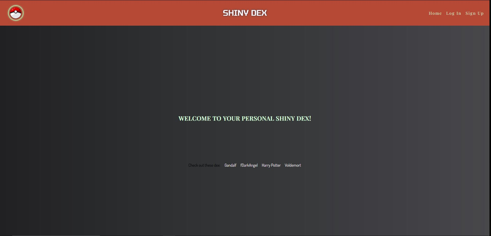
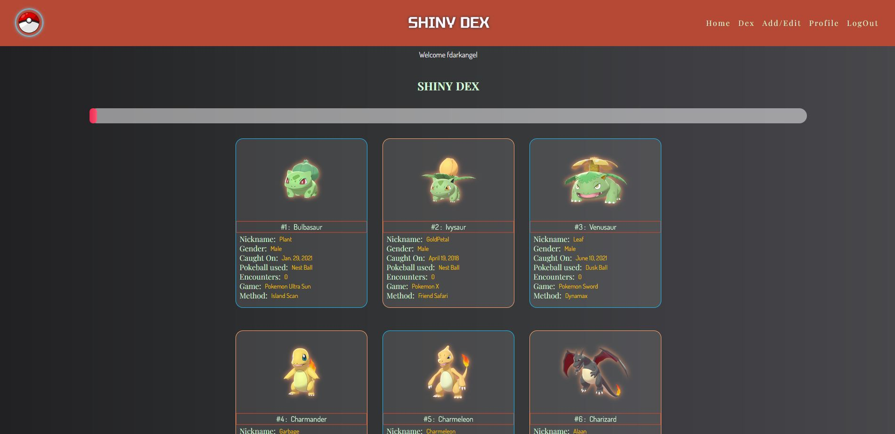
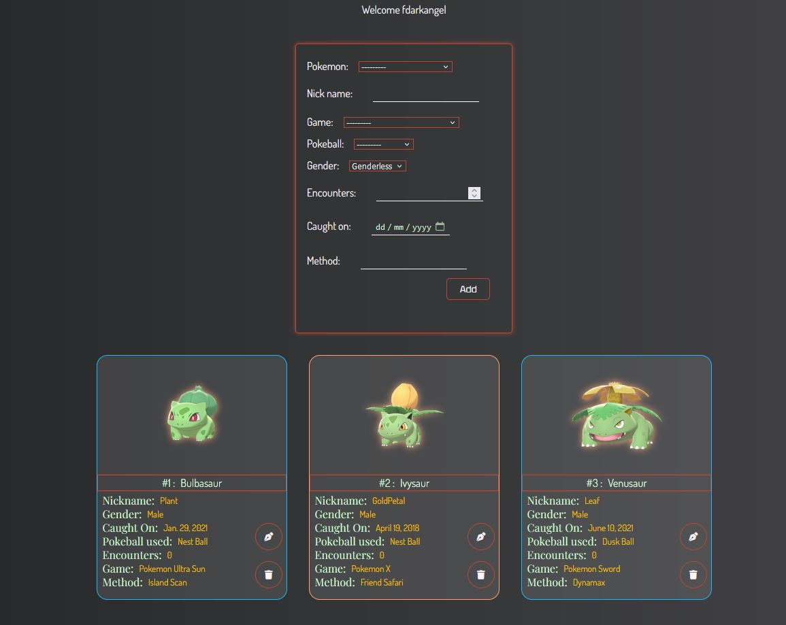

# Shiny Dex
  

[Live Site Here](https://shiny-dex.up.railway.app/)

The website is a place for Pokemon Shiny Hutner, where they can store the data of their hunts of [shiny pokemon](https://pokemondb.net/pokedex/shiny) like nickname, game hunted in, type of pokeball used, etc. The users can also view their "shiny dex" where all their data is listed.

Shiny Hunting is a big part of Pokemon Community, where "hunters" spend days and months in serch for "differently colored" pokemon. Shinies were initially introduced in Gen 2 with the odds of 1/8192. This changed since Gen 6 where the odds were buffed with 1/4096. This can be further reduced by obtaining "shiny charm" in the game or using carious hunting methods unique to the generation of the pokemon game.
   

### Homapage

### Dex Page

### Add/Edit Page

### Technology Used:
- HTML/CSS
- Python
- Django
- PostgreSQL (ElephantSQL)
- Cloudinary (Image storage)

#### Pokemon images used from [Serebii](https://www.serebii.net/) website.

### Enjoy!

